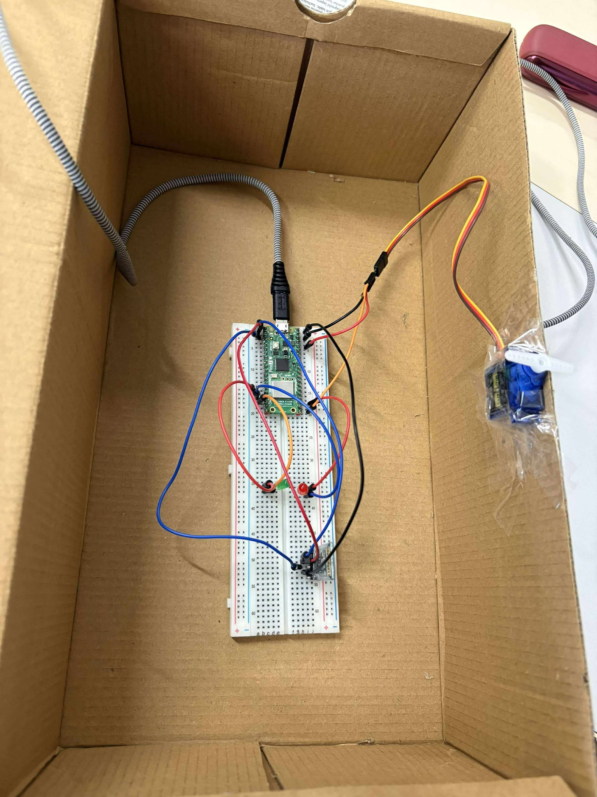
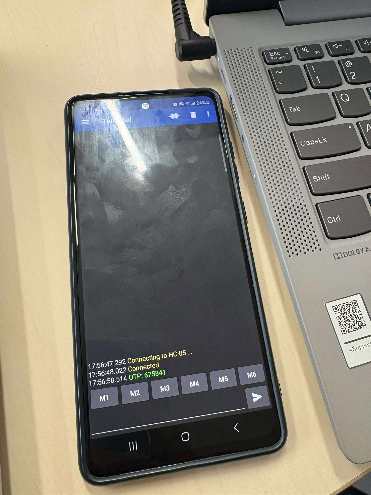
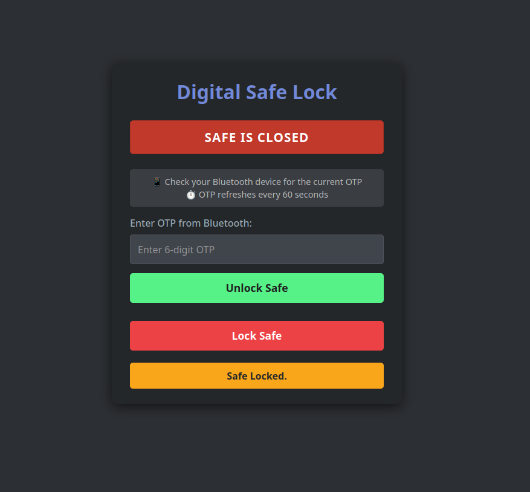
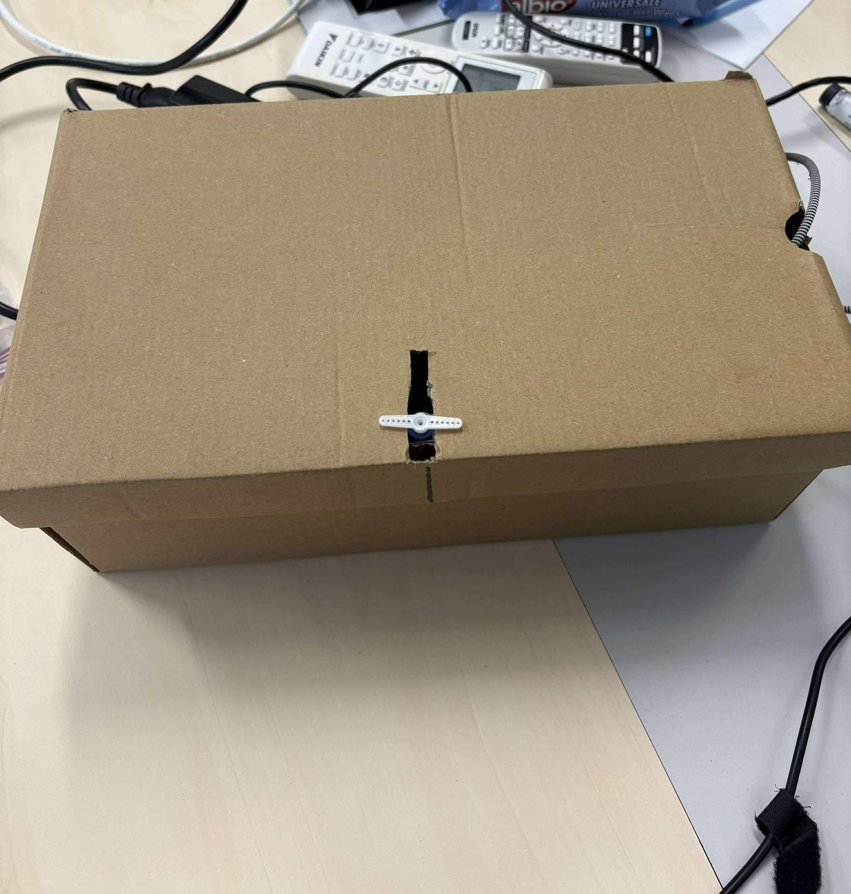

# Bluetooth OTP Digital Safe

A secure IoT-based digital safe control system using Raspberry Pi Pico W with One-Time Password (OTP) authentication delivered via Bluetooth.

## Short Description

This project implements a smart digital safe lock system that combines web-based control with Bluetooth OTP security. The system generates a new 6-digit authentication code every 60 seconds and transmits it to your phone via Bluetooth (HC-05 module). Users can then access the web interface to unlock the safe using the current OTP, providing an extra layer of security beyond traditional password systems.

## Demo Video

[📹 Watch the Project Demo on YouTube](https://www.youtube.com/watch?v=6JitznnkUbk)

## Features

- **OTP Security**: 6-digit codes regenerated every 60 seconds
- **Bluetooth Integration**: Automatic OTP delivery to paired devices
- **Web Interface**: Clean, responsive web control panel
- **Servo Control**: Precise safe mechanism control (90° closed, 180° open)
- **Real-time Status**: Live safe status monitoring
- **Fallback Mode**: Continues operating even without WiFi
- **Mobile Responsive**: Works on phones, tablets, and computers

## Hardware Requirements

### Components
- **Raspberry Pi Pico W** - Main microcontroller with WiFi
- **SG90 Servo Motor** - Safe locking mechanism
- **HC-05 Bluetooth Module** - OTP transmission to mobile devices
- Jumper wires and breadboard
- Power supply (5V recommended for servo)

### Wiring Connections

| Component | Pico W Pin | Notes |
|-----------|------------|-------|
| SG90 Servo | GPIO 16 | PWM control pin |
| HC-05 TX | GPIO 1 (RX) | Bluetooth data |
| HC-05 RX | GPIO 0 (TX) | Bluetooth data |
| HC-05 VCC | 3.3V | Power |
| HC-05 GND | GND | Ground |
| Servo VCC | VBUS (5V) | Power |
| Servo GND | GND | Ground |



## Software Setup

### Prerequisites
- MicroPython firmware on Raspberry Pi Pico W
- Bluetooth terminal app on your mobile device
- Basic understanding of MicroPython

### Installation Steps

1. **Prepare the Pico W**
   ```bash
   # Flash MicroPython firmware to your Pico W
   # Use Thonny IDE or your preferred MicroPython editor
   ```

2. **Configure WiFi Credentials**
   ```python
   # Edit these lines in main.py
   WIFI_SSID = "YOUR_WIFI_SSID"
   WIFI_PASSWORD = "YOUR_WIFI_PASSWORD"
   ```

3. **Upload the Code**
   - Copy `main.py` to your Pico W
   - Ensure all connections are secure
   - Reset the device

4. **Pair Bluetooth Device**
   - Power on your Pico W
   - Pair your phone with the HC-05 module (usually named "HC-05")
   - Default pairing code is typically `1234` or `0000`

## How to Run the Project

### Step 1: Power On
1. Connect your assembled circuit to power
2. The Pico W will automatically start and connect to WiFi
3. The servo will initialize to the CLOSED position (90°)

### Step 2: Find the IP Address
Monitor the serial output to find the assigned IP address:
```
=== Digital Safe with OTP System Starting ===
Connecting to WiFi...
Connected! Pico IP Address: 192.168.1.xxx
```

### Step 3: Set Up Bluetooth
1. Open a Bluetooth terminal app on your phone
2. Connect to the paired HC-05 module
3. You should start receiving OTP codes every 60 seconds:
   ```
   OTP: 123456
   OTP: 789012
   OTP: 345678
   ```



### Step 4: Access Web Interface
1. Open a web browser on any device connected to the same WiFi network
2. Navigate to the IP address shown in Step 2
3. You'll see the Digital Safe Control interface



### Step 5: Unlock the Safe
1. Check your Bluetooth app for the current 6-digit OTP
2. Enter the OTP in the web interface password field
3. Click "Unlock Safe"
4. The servo will rotate to 180° (OPEN position)
5. Click "Lock Safe" to secure it again (90° position)


## System Operation

### OTP Generation
- New 6-digit codes generated every 60 seconds
- Codes are cryptographically random using `urandom`
- Only the current OTP is valid for unlocking

### Security Features
- **Time-based Authentication**: OTPs expire automatically
- **Bluetooth Delivery**: Codes sent only to paired devices  
- **No Password Storage**: OTPs are not stored permanently
- **Real-time Validation**: Immediate feedback on authentication attempts

### Status Monitoring
The web interface provides real-time status updates:
- **Safe Status**: Visual indication of OPEN/CLOSED state
- **OTP Timer**: Shows when next code will be generated
- **Action Feedback**: Confirms successful operations

## Troubleshooting

### Common Issues

**WiFi Connection Failed**
```
Failed to connect to WiFi.
Running in Bluetooth-only mode...
```
- Verify SSID and password in code
- Check WiFi network availability
- System continues with Bluetooth functionality

**Bluetooth Not Working**
- Ensure HC-05 is properly wired
- Check pairing status on mobile device
- Verify UART pins (TX/RX) are correctly connected

**Servo Not Moving**
- Confirm servo power supply (5V recommended)
- Check PWM pin connection (GPIO 16)
- Verify servo is not mechanically blocked

**OTP Not Accepted**
- Ensure you're using the most recent OTP
- Check for typos in 6-digit code
- Wait for next OTP generation if code expired

### Debug Commands

Send these commands via Bluetooth for diagnostics:
```
HELLO          # Test connectivity
NEWOTP         # Force new OTP generation
```

## Customization Options

### Timing Configuration
```python
OTP_LIFETIME_SECONDS = 60    # Change OTP refresh rate
OTP_LENGTH = 6               # Modify OTP length
```

### Servo Angles
```python
ANGLE_OPEN = 180     # Fully open position
ANGLE_CLOSED = 90    # Locked position
```

### Hardware Pins
```python
SERVO_PIN = 16       # Servo control pin
UART_TX_PIN = Pin(0) # Bluetooth TX
UART_RX_PIN = Pin(1) # Bluetooth RX
```

## Safety Considerations

⚠️ **Important Safety Notes:**
- This is a demonstration project, not a commercial security system
- For actual valuables, use certified security equipment
- Always have a manual override method
- Test thoroughly before deploying
- Keep backup access methods available

## Project Photos

### Assembled Project


## Technical Specifications

| Parameter | Value |
|-----------|-------|
| Microcontroller | Raspberry Pi Pico W |
| Operating Voltage | 3.3V (5V for servo) |
| WiFi | 802.11n 2.4GHz |
| Bluetooth | Classic 2.0 via HC-05 |
| Servo Type | SG90 (180° rotation) |
| OTP Length | 6 digits |
| OTP Refresh Rate | 60 seconds |
| Web Server Port | 80 (HTTP) |
| UART Baudrate | 9600 |

## Future Enhancements

- [ ] HTTPS encryption for web interface
- [ ] Mobile app with push notifications
- [ ] Multiple user OTP codes
- [ ] Audit log of access attempts
- [ ] Battery backup system
- [ ] Integration with home automation systems

## Contributing

Feel free to fork this project and submit improvements! Areas for contribution:
- Enhanced security features
- Mobile app development
- Alternative hardware support
- Documentation improvements

## License

This project is open source. Use responsibly and at your own risk.

## Acknowledgments

- Raspberry Pi Foundation for the Pico W platform
- MicroPython community for excellent documentation
- Contributors to the HC-05 Bluetooth module libraries

---

**⚡ Built with MicroPython | 🔒 Secured with OTP | 📱 Connected via Bluetooth**
